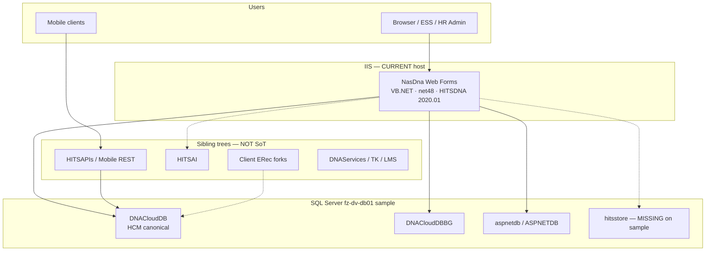

# ARCHITECTURE.md — HITSHCM current-state entry

> **Status:** CURRENT STATE of the brownfield HCM system (not target architecture)  
> **Updated:** 2026-09-21 (Africa/Cairo)  
> **Decision:** D-009 — this pack is the Cursor source of truth for *current* system shape  
> **Depth:** [`docs/architecture/current-state.md`](docs/architecture/current-state.md)  
> **Diagram:** [`docs/architecture/context.mermaid`](docs/architecture/context.mermaid)

## Before you change code

1. Read this file + [`docs/architecture/current-state.md`](docs/architecture/current-state.md)
2. Read [`docs/inventory/00-index.md`](docs/inventory/00-index.md) and [`DECISIONS.md`](DECISIONS.md)
3. Edit **only** under `C:\Users\mina\Projects\HITSHCM\` unless Mina explicitly expands scope
4. Treat SoT code as **read-only**: `D:\Workspaces\HITSNasDnaFS\HITSNasDna`

## CURRENT vs TARGET (do not confuse)

| | CURRENT (documented here) | TARGET (strategy only) |
|---|---|---|
| App | VB.NET ASP.NET Web Forms, .NET Framework **4.8**, assembly **HITSDNA 2020.01** | New API + optional new UI slices |
| Host | IIS / classic ASP.NET pipeline | New hosts for slices; legacy stays on IIS during strangler |
| Data | SQL Server `DNACloudDB` (+ BG + aspnetdb); L2S `NasDB.dbml` + Profile routing | Same SQL; new contracts anti-corrupt against DNACloudDB |
| Strategy | Brownfield production monolith | **Strangler + API-first** (D-001, D-002) — **not** greenfield rewrite |

Do **not** invent target stack detail beyond: strangler fig, API-first, keep legacy running. First slice is still TBD (D-004 / D-005).

## One-paragraph reality

**HITSDNA / NasDna** is an enterprise HCM Web Forms monolith (~1573 `.aspx`, ~615 `.ascx`) in solution `HITSNasDna.sln`. Runtime is IIS + Forms auth (`logon.aspx`) + SQL Membership/Profile on `ASPNETDB`, with business data on `DNACloudDB` and business-group setup on `DNACloudDBBG`. LINQ-to-SQL context `NASDataSource` opens with **`Profile("ConnectionString")`** (per-user/tenant routing). Canonical schema package: `docs/inventory/db/DNACloudDB.dacpac` (D-008). Sibling trees (mobile REST, HITSAI, ERec forks, integrations) already sit outside the monolith — use them as strangler seams, not as SoT.

## Context diagram

## UI/UX modernization track (D-012)

UI/UX is a **parallel track** to API/data strangler — not leftover polish.

- Spec: [`docs/architecture/target-ux.md`](docs/architecture/target-ux.md)
- Stack: Razor Pages default; Blazor for interactive modules (D-005); .NET 10 (D-011a)
- Each slice must meet TARGET UX DoD (layout, tokens, RTL, patterns)

## TARGET architecture (modernized)

> For **new** slices and strangler work — not the live SoT.

- **Depth:** [`docs/architecture/target-state.md`](docs/architecture/target-state.md)
- **Diagram:** [`docs/architecture/target-context.mermaid`](docs/architecture/target-context.mermaid)
- **Decision:** D-011 TARGET baseline

- **Shape:** 3-tier for new work — **Razor Pages** (default) / Blazor (optional) → ASP.NET Core API (.NET 10 / C#) → SQL (`DNACloudDB` SoR) — strangling the CURRENT 2-tier Web Forms app. Legacy IIS stays up; new code does **not** land in the SoT tree by default.
- **First TARGET host (AUTH-1):** `Hitshcm.sln` / `src/Hitshcm.Web` — OpenIddict local IdP + BFF cookie. See [`docs/AUTH.md`](docs/AUTH.md).

| CURRENT | TARGET |
|---------|--------|
| VB Web Forms ↔ SQL (2-tier) | UI → API → SQL (3-tier) |
| Logic in VB + T-SQL | New domain logic in API; wrap legacy procs via adapters |
| Forms auth | Bridge → OIDC |

When implementing modernization features, follow **TARGET**. When reading/debugging legacy, follow **CURRENT** (`docs/architecture/current-state.md`).

## Tier model (confirmed 2026-09-21)

**Yes — the SoT app is a classic 2-tier system:**

1. **Tier 1 — Web:** IIS-hosted ASP.NET Web Forms (`NasDna`) — VB.NET code-behind + controls  
2. **Tier 2 — SQL:** SQL Server (`DNACloudDB` / BG / aspnetdb) — tables, views, procs, functions  

Browser talks to IIS; IIS talks to SQL. There is **no application middle tier** inside the SoT solution (no meaningful WCF/`.svc` service layer; only a couple of `.asmx`/`.ashx` endpoints). SSRS and a few external HTTP APIs are **edge integrations**, not a 3rd business tier.

### Where business logic lives (important nuance)

**Not “all business logic is in SQL.”** It is **split**, with SQL holding a *large* share:

| Location | Evidence (SoT / live DB) | Role |
|----------|---------------------------|------|
| **SQL Server** | ~1804 procs, ~407 functions, ~368 views, ~805 tables | Domain rules, calculations, batch/HCM operations, security filters |
| **VB Web Forms** | ~817 `.aspx.vb`, ~321 `.ascx.vb`, ~29 `AppCode` files; hundreds of `SqlConnection`/`SqlCommand`/`NASDataSource` call sites | UI orchestration, validation, workflow glue, calling procs/L2S/ADO |

**Strangler implication:** moving a slice means extracting rules from **both** VB code-behind *and* T-SQL — not “just wrap the database.”

## Hard paths

| Role | Path |
|---|---|
| **SoT code (READ ONLY)** | `D:\Workspaces\HITSNasDnaFS\HITSNasDna` |
| Solution | `...\HITSNasDna\HITSNasDna.sln` |
| Web project | `...\HITSNasDna\NasDna\NasDna.vbproj` |
| Sibling compare only | `D:\Workspaces\HITSNasDnaFS\HITSNasDnaV12.1` |
| **Write root** | `C:\Users\mina\Projects\HITSHCM\` |
| Canonical dacpac | `C:\Users\mina\Projects\HITSHCM\docs\inventory\db\DNACloudDB.dacpac` |
| Never touch | `D:\Workspace\Roadmap\HITSDo\HITSDoForC`, EasyDO |

## Pointers

- Full current-state: [`docs/architecture/current-state.md`](docs/architecture/current-state.md)
- Inventory: [`docs/inventory/00-index.md`](docs/inventory/00-index.md) → 01–09
- Decisions: [`DECISIONS.md`](DECISIONS.md) (D-007 SoT, D-008 dacpac, D-009 this pack)
- Gotchas / memory: [`GOTCHAS.md`](GOTCHAS.md), [`MEMORY.md`](MEMORY.md)

## Related
- [Data dictionary + control libraries](docs/architecture/data-dictionary-controls.md)
- [Session & auth management](docs/architecture/session-management.md)

- [TARGET session & auth modernization](docs/architecture/target-session.md)

