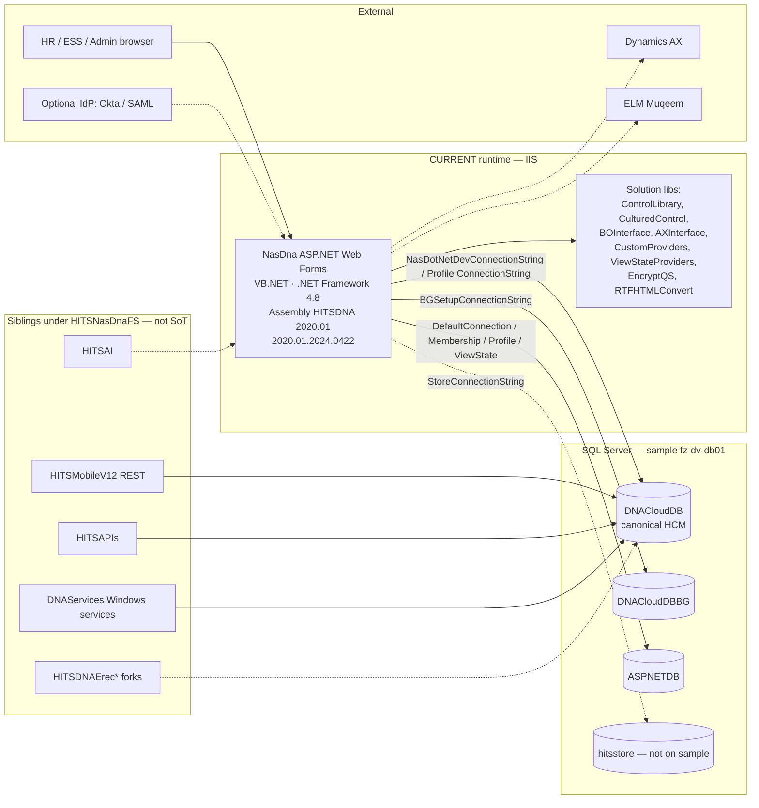

# Current-state architecture — HITS NasDna / HITSDNA HCM

> **Label:** CURRENT STATE (brownfield)  
> **Not this doc:** future target platform detail (see strategy notes only)  
> **Updated:** 2026-09-21 (Africa/Cairo)  
> **Verified against:** live SoT `D:\Workspaces\HITSNasDnaFS\HITSNasDna` + inventory pack `docs/inventory/`  
> **Agent entry:** [`ARCHITECTURE.md`](../../ARCHITECTURE.md)  
> **Decision:** D-009

---

## 1. Purpose & status

Document how the **production brownfield** HCM system is shaped today so Cursor agents:

- Stop inventing a greenfield stack
- Point edits and plans at the correct SoT tree
- Respect strangler + API-first constraints already decided (D-001, D-002)

**HITSHCM** (`C:\Users\mina\Projects\HITSHCM\`) is the modernization *workspace* (docs, dacpacs, agent rules). It is **not** the application source tree.

| Label | Meaning |
|---|---|
| **CURRENT** | What runs / what SoT code is |
| **TARGET** | Strangler direction only — no stack lock beyond API-first |

---

## 2. Context diagram

See also [`context.mermaid`](context.mermaid).



---

## 3. Solution structure (SoT)

**Solution file:** `D:\Workspaces\HITSNasDnaFS\HITSNasDna\HITSNasDna.sln`

### Projects in the `.sln` (verified)

| Project | Path | Role |
|---|---|---|
| **NasDna** | `NasDna\NasDna.vbproj` | Primary web app (VB.NET Web Forms library / IIS site) |
| HITSCulturedControl | `HITSCulturedControl\` | Localized / cultured UI controls |
| HITSControlLibrary | `HITSControlLibrary\` | Shared UI/control library |
| HITSBOInterface | `HITSBOInterface\` | Business-object / interface layer |
| HITSAXInterface | `HITSAXInterface\` | Dynamics AX integration interface |
| CustomProviders | `CustomProviders\` | Custom ASP.NET providers |
| CustomViewStateProviders | `CustomViewStateProviders\` | SQL view-state provider (wired in Web.config) |
| HITSEncryptQS | `HITSEncryptQS\HITSEncryptQS\` | Query-string encryption helper |
| RTFHTMLConvert | `RTFHTMLConvert\` | RTF↔HTML conversion |
| DevDocuments | `DevDocuments\` | Dev docs project |

### On disk but **not** listed in the `.sln`

| Folder | Role |
|---|---|
| `NasDna.Azure`, `NasDnaHTTPS*.Azure`, `NasDna.hitsdnalite`, `AzureCloudService1` | Azure Cloud Service / HTTPS deploy variants |
| `HITSCryptography` | Crypto library (often HintPath DLL into NasDna) |
| `packages` | NuGet restore root |

### Web project facts (verified from `NasDna.vbproj` + `AssemblyInfo.vb`)

| Fact | Value |
|---|---|
| Language | VB.NET |
| UI | ASP.NET Web Forms (`.aspx` / `.ascx` / master pages) |
| `TargetFrameworkVersion` | **v4.8** |
| `AssemblyName` | NasDna |
| Assembly title/product | **HITSDNA 2020.01** |
| `AssemblyVersion` | **2020.01.2024.0422** |
| ToolsVersion | 12.0 |
| Footprint (NasDna tree) | **1573** `.aspx`, **615** `.ascx` |
| Footprint (SoT root) | **~8479** files |

**Sibling compare line (NOT SoT):** `HITSNasDnaV12.1` — HITS V12 branding `12.9727.9727.27000`, ~1559 aspx. Diffs only (D-007).

---

## 4. Runtime & request path

```text
Browser
  → IIS site (NasDna)
    → ASP.NET Forms Auth cookie (.ASPXAUTH) ; loginUrl = logon.aspx
    → Page / UserControl lifecycle (Web Forms)
    → Shared AppCode (NASDataSource, helpers) + control libraries
    → SQL via:
         Profile("ConnectionString")  → tenant/user HCM DB (usually DNACloudDB family)
         Named connectionStrings      → ASPNETDB / DNACloudDBBG / hitsstore / viewstate
```

| Concern | CURRENT behavior |
|---|---|
| Host | IIS + System.Web |
| Auth mode | **Forms** (`loginUrl=logon.aspx`, timeout 30, cookie `.ASPXAUTH`) |
| Membership / roles / profile | SQL providers on **`DefaultConnection` → ASPNETDB** |
| Session | **InProc** (Redis custom provider exists in config as alternate — do not treat as live default; never copy secrets from Web.config) |
| ViewState | `SqlViewStateProvider` → `ViewStateConnectionString` → ASPNETDB |
| Personalization | `DNAPersonalizationProvider` → `DefaultConnection`, app name `/hragentic` |
| Compilation / httpRuntime | targetFramework **4.8** |

Optional IdP packages/config (Okta OIDC, ComponentSpace SAML, OWIN) coexist with classic Membership — **dual auth eras**. SAML endpoints live under `NasDna\SAML\`.

---

## 5. Module map (SoT `NasDna\` live scan 2026-09-21)

Counts are recursive under each folder. Root has **34** additional `.aspx`.

### High-density (defer early strangler)

| Folder | .aspx | Notes |
|---|---:|---|
| NasSetup | 639 | Config spine |
| NasBatches | 209 | Batch UI |
| NasForms | 167 | Dynamic forms platform |
| WorkFlow | 145 | Approvals / queues |
| Reports | 69 (+172 ascx) | ReportViewer + SSRS web refs |
| Common | 54 (+191 ascx) | Shared UI kernel |

### Bounded / better first-slice surfaces

| Folder | .aspx | Notes |
|---|---:|---|
| IOT | 48 | Assets, visitors, gateways, heatmaps |
| SSInquiries | 40 | Self-service inquiries |
| NasAI | 20 | In-app AI pages (also HITSAI sibling) |
| ERec | 17 | E-recruitment (client forks exist) |
| ETraining | 16 | Training (HitsLMS sibling) |
| TimeManagement | 14 | Attendance / shifts (TK siblings) |
| NasAgenda | 13 | Agenda |
| HRKPI | 12 | KPI / budgets |
| AboutCompany | 11 | Org profile |
| NasMuqeem | 10 | Saudi ELM Muqeem |
| NasAX | 10 | Dynamics AX setup |
| EObjectives | 10 | Objectives / goals |
| IBMIntegration | 8 | IBM |
| Security / SAML / Batches | small | Auth edge / legacy batch |

### Infrastructure hubs

| Folder | Role |
|---|---|
| **AppCode** | `NasDB.dbml`, `NASDataSource`, shared VB helpers — **central coupling** |
| DataSets | Typed DataSets (ADO.NET TableAdapters) |
| Models | Thin EF6 Identity / ADAL island |
| App_Start / Global.asax* | Startup / application events |
| Web References | SSRS RSServer / RS2008 / RSServerAzure |
| MuqeemDLL / CryptClass / HITSIBMClient / IOTHeatMap | Local HintPath binaries |

Full area narrative (V12.1-era tables, still directionally valid): [`docs/inventory/02-nasdna-areas.md`](../inventory/02-nasdna-areas.md). Prefer **SoT counts above** when they differ.

---

## 6. Data & persistence

### Catalogs (Web.config names — secrets redacted)

Sample server in SoT Web.config: `fz-dv-db01` (non-prod inventory). **Do not assume production.**

| Connection name | Initial Catalog | Role |
|---|---|---|
| `LocalSqlServer` | ASPNETDB | Membership override of machine.config |
| `DefaultConnection` | ASPNETDB | Membership / profile / roles / personalization |
| `NasDotNetDevConnectionString` | **DNACloudDB** | Primary HCM catalog (named string) |
| `BGSetupConnectionString` | **DNACloudDBBG** | Business-group setup |
| `ViewStateConnectionString` | ASPNETDB | SQL view state |
| `StoreConnectionString` | **hitsstore** | Store — **catalog missing** on fz-dv-db01 under that name |

### Runtime routing (critical)

```vb
' AppCode\NASDataSource.vb — CURRENT pattern
Public Sub New()
    MyBase.New(Web.HttpContext.Current.Profile.Item("ConnectionString").ToString)
    ...
End Sub
```

- `NASDataSource` inherits LINQ-to-SQL `NasDBDataContext`.
- Default ctor uses **`Profile("ConnectionString")`**, not a hard-coded Web.config name.
- Multi-tenant / per-user catalogs are **not fully enumerated in-repo**.

### Access eras (all CURRENT)

| Pattern | Evidence | Weight |
|---|---|---|
| **LINQ to SQL** | `AppCode\NasDB.dbml` (~503 `<Table>` maps), `NASDataSource` | Primary HCM façade |
| **Raw ADO.NET** | Widespread `SqlConnection` / `SqlCommand` | Dominant in pages |
| **Typed DataSets** | `DataSets\*.xsd` | Classic TableAdapter islands |
| **Enterprise Library Data** | package refs | Legacy block |
| **EF6** | `Models\ApplicationDbContext`, Identity | Thin island — **not** main HCM path |

### Live schema (D-008 canonical package)

| Artifact | Path |
|---|---|
| **Canonical dacpac** | `docs/inventory/db/DNACloudDB.dacpac` |
| BG dacpac | `docs/inventory/db/DNACloudDBBG.dacpac` |
| aspnetdb dacpac | `docs/inventory/db/aspnetdb.dacpac` |
| dbo browse scripts | `docs/inventory/db/DNACloudDB-schema/dbo/` |

**DNACloudDB live shape (fz-dv-db01 sample):** ~805 base tables (dbo 555 / XWB 249 / XRP 1), ~368 views, ~1804 procs, compat 140. DBML maps ~503 tables → **partial façade** vs live DB.

Schemas of note: **dbo**, **XWB**, **XRP**.

Known extract warnings: `[dbo].[hits_EmpHistory]`, `[dbo].[hits_GetBudgets]` (syntax near `FROM`).

Details: [`docs/inventory/04-data-touchpoints.md`](../inventory/04-data-touchpoints.md), [`docs/inventory/09-db-inventory.md`](../inventory/09-db-inventory.md), [`docs/inventory/db/README.md`](../inventory/db/README.md).

---

## 7. Auth & tenancy / BG

| Layer | CURRENT |
|---|---|
| Primary gate | Forms authentication → `logon.aspx` |
| Store | SQL Membership / Role / Profile on **ASPNETDB** |
| Tenancy | Profile properties including **`ConnectionString`** (DB routing) + Lang / LogonName etc. |
| Business groups | **DNACloudDBBG** via `BGSetupConnectionString` |
| Federation options | Okta (OIDC packages + appSettings keys), ComponentSpace SAML (`NasDna\SAML`), OWIN stack present |
| Windows roles provider | Also registered (`AspNetWindowsTokenRoleProvider`) alongside SqlRoleProvider |

**Agent rule:** never commit or paste live Okta/Redis/connection secrets. Redact to `***`.

---

## 8. External / sibling touchpoints

Workspace root: `D:\Workspaces\HITSNasDnaFS` (read-only for agents unless Mina says otherwise).

| Sibling | Relation to SoT |
|---|---|
| **HITSNasDnaV12.1** | Parallel V12-branded line — **compare/diff only** |
| HITSMobileV12 / HITSmobile | Mobile + REST — existing API-ish edge |
| HITSAPIs | Thin employee C# API |
| HITSAI | AI sidecar (doc search, data chat, APIs); NasAI pages inside monolith |
| HitsLMS / HITSTKService / DNATimeClient2 | Learning / timekeeping edges |
| DNAServices | Windows services (sync, email, cleanup, AX, …) |
| HitsIntegeration* / ZHitsIntegeration | Integration solutions that **re-embed** NasDna |
| HITSDNAErec* | Per-customer e-recruitment **forks** of NasDna |
| HITSReports | SSRS-style report packages |
| Z* dated folders | Snapshots / archives — not SoT |

See [`docs/inventory/05-siblings.md`](../inventory/05-siblings.md), [`docs/inventory/01-repo-map.md`](../inventory/01-repo-map.md).

---

## 9. Cross-cutting concerns

| Concern | CURRENT |
|---|---|
| Reporting | In-app ReportViewer + `Reports\` + Web Refs to SSRS; sibling `HITSReports`; Power BI JS/API packages present |
| Jobs / background | `DNAServices` Windows services; in-app `NasBatches` |
| AI | `NasDna\NasAI` UI + external `HITSAI` |
| Integrations | AX (`HITSAXInterface` / `NasAX`), IBM, Muqeem/ELM, digital signature sibling |
| Cloud storage | Azure Storage + AWS S3 + Google Drive/Forms packages (multi-home) |
| Localization | `HITSCulturedControl`, many `*_ar` pages |

Dependencies inventory: [`docs/inventory/03-dependencies.md`](../inventory/03-dependencies.md).

---

## 10. Constraints for modernization (CURRENT → TARGET)

Already decided — do not reopen casually:

1. **D-001** — Modernization of existing suite, not greenfield product fantasy  
2. **D-002** — **Strangler fig**, not big-bang rewrite of 1500+ pages  
3. **D-007** — SoT = `HITSNasDna` (not V12.1)  
4. **D-008** — Full `DNACloudDB.dacpac` is canonical schema package  
5. Strategy lean: **API-first** slices; keep Web Forms running; anti-corrupt against DNACloudDB  
6. Do **not** start with NasSetup / WorkFlow / NasForms / NasBatches  
7. Do **not** invent another full NasDna client fork for new ERec customers  
8. Do **not** “upgrade in place” Web Forms to .NET 8  

**TARGET** detail still open: first slice (D-004), new UI/API stack for slices (D-005). Hypotheses in [`docs/inventory/06-strangler-candidates.md`](../inventory/06-strangler-candidates.md) and [`07-recommendation.md`](../inventory/07-recommendation.md) — pending Mina.

---

## 11. Known risks / gotchas (documented)

| Risk | Note |
|---|---|
| Wrong tree | Agents must not treat V12.1 or Integration embeds as SoT |
| Profile routing | Static Web.config catalogs ≠ all runtime DBs |
| Dual data eras | L2S + DataSets + EntLib + EF6 Identity — do not assume one ORM |
| Dual auth eras | Membership + Okta/SAML/OWIN |
| DBML incomplete | ~503 mapped vs ~805 live tables |
| hitsstore missing | Named in config; not on sample server |
| Broken procs in model | `hits_EmpHistory`, `hits_GetBudgets` |
| Secret hygiene | Web.config may contain IdP/Redis material — never copy into HITSHCM docs |
| UTF-16 markdown | Some `.md` may be UTF-16 — detect BOM; write UTF-8 |
| EasyDO quarantine | Never touch `HITSDoForC` / EasyDO paths |

---

## 12. Pointers checklist

| Need | Go to |
|---|---|
| Agent one-pager | [`ARCHITECTURE.md`](../../ARCHITECTURE.md) |
| Inventory index | [`docs/inventory/00-index.md`](../inventory/00-index.md) |
| SoT decision | [`docs/inventory/08-source-of-truth.md`](../inventory/08-source-of-truth.md) |
| DB / dacpacs | [`docs/inventory/09-db-inventory.md`](../inventory/09-db-inventory.md), [`db/README.md`](../inventory/db/README.md) |
| Decisions log | [`DECISIONS.md`](../../DECISIONS.md) |
| Working memory | [`MEMORY.md`](../../MEMORY.md) |

## Tier model (confirmed 2026-09-21)

**Yes — the SoT app is a classic 2-tier system:**

1. **Tier 1 — Web:** IIS-hosted ASP.NET Web Forms (`NasDna`) — VB.NET code-behind + controls  
2. **Tier 2 — SQL:** SQL Server (`DNACloudDB` / BG / aspnetdb) — tables, views, procs, functions  

Browser talks to IIS; IIS talks to SQL. There is **no application middle tier** inside the SoT solution (no meaningful WCF/`.svc` service layer; only a couple of `.asmx`/`.ashx` endpoints). SSRS and a few external HTTP APIs are **edge integrations**, not a 3rd business tier.

### Where business logic lives (important nuance)

**Not “all business logic is in SQL.”** It is **split**, with SQL holding a *large* share:

| Location | Evidence (SoT / live DB) | Role |
|----------|---------------------------|------|
| **SQL Server** | ~1804 procs, ~407 functions, ~368 views, ~805 tables | Domain rules, calculations, batch/HCM operations, security filters |
| **VB Web Forms** | ~817 `.aspx.vb`, ~321 `.ascx.vb`, ~29 `AppCode` files; hundreds of `SqlConnection`/`SqlCommand`/`NASDataSource` call sites | UI orchestration, validation, workflow glue, calling procs/L2S/ADO |

**Strangler implication:** moving a slice means extracting rules from **both** VB code-behind *and* T-SQL — not “just wrap the database.”

