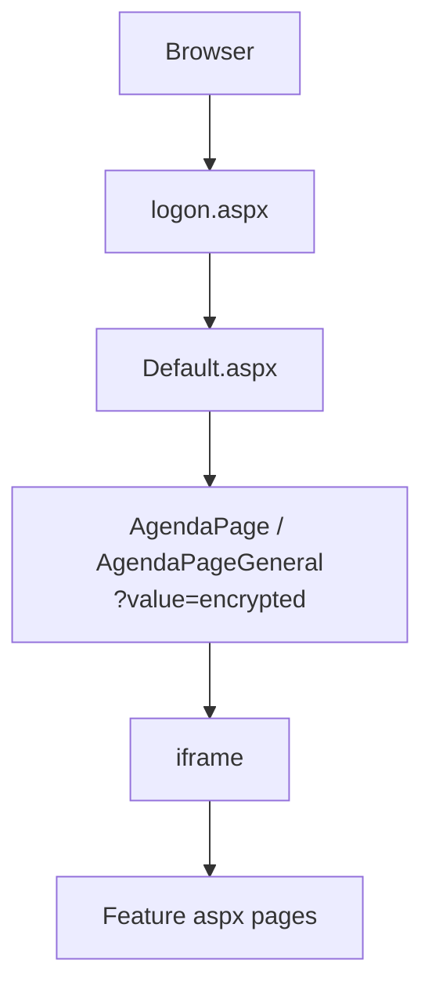

# CURRENT navigation hub

> Captured 2026-09-21 from live URLs + SoT `HITSNasDna\NasDna`.
>
> Diagram: [navigation-hub.mermaid](navigation-hub.mermaid)

## Your URLs mapped

| URL | Role |
|-----|------|
| `./logon.aspx?ReturnUrl=%2fDefault.aspx` | Login gate |
| `./Default.aspx` | Home shell |
| `./NasAgenda/AgendaPage.aspx?value=…` | Employee / agenda menu hub |
| `./NasAgenda/AgendaPageGeneral.aspx?value=…` | General menu hub |

## Flow

```text
Browser
  -> logon.aspx?ReturnUrl=/Default.aspx
       FormsAuthentication (+ optional OIDC / Okta / SAML)
       cookie identity = user + server + database
  -> Default.aspx
       Master: NasAgenda/NasWebGeneralMP.master
       home / web-parts landing
  -> NasAgenda/AgendaPage.aspx?value=...
  or NasAgenda/AgendaPageGeneral.aspx?value=...
       builds links from menu (ItemProg / ItemAProg)
       encrypts with HITSEncryptQS.HITSQueryString
       opens target in iframe
  -> feature aspx (NasSetup, ERec, Batches, ...)
```



## What `?value=` is

Encrypted deep link (not a plain id).  
Encrypt: `HITSEncryptQS.HITSQueryString`  
Decrypt on request: `AppCode/QueryStringModule.vb` when `EnableQSEncryption` is on.

## Strangler implication

App = **shell + encrypted deep-link + iframe host**, not folder browsing.

- **Mode A (fast):** new Razor slice still launched from legacy Agenda (iframe / QS bridge)
- **Mode B (later):** replace Default/Agenda shell after a few slices exist

## Hub SoT files

| Role | Path |
|------|------|
| Login | `logon.aspx` |
| Home | `Default.aspx` + `NasAgenda/NasWebGeneralMP.master` |
| Hubs | `NasAgenda/AgendaPage.aspx`, `AgendaPageGeneral.aspx` |
| Agenda master | `NasAgenda/NasAgendaMP.master` |
| QS crypto | `AppCode/QueryStringModule.vb`, `HITSEncryptQS` |

- [Data dictionary + HITSCulturedControl / HITSControlLibrary](data-dictionary-controls.md)


- [Session & auth management](session-management.md)


- [TARGET session & auth modernization](docs/architecture/target-session.md)

