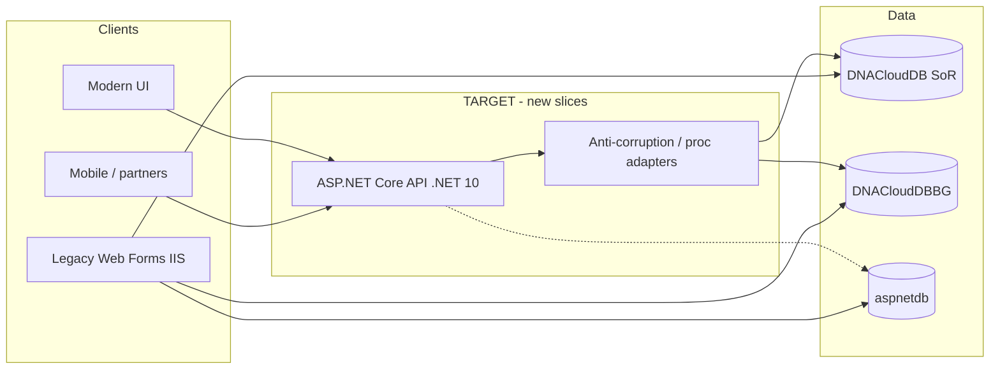

# TARGET architecture — modernized HITSHCM (strangler)

> **Status:** TARGET (to-be) for **new** slices and gradual replacement  
> **Not** a description of today’s SoT — see [`current-state.md`](current-state.md)  
> **Updated:** 2026-09-21  
> **Decisions:** D-001 brownfield · D-002 strangler · D-008 full dacpac · D-010 2-tier CURRENT · **D-011 TARGET baseline (this pack)** · D-004 first slice still open · **D-005 UI locked (Razor default / Blazor optional)** · **D-011a .NET 10 LTS**

## One-sentence TARGET

New HCM capabilities ship as **C# / ASP.NET Core APIs + a modern UI**, strangling the VB Web Forms monolith while **`DNACloudDB` stays the system of record** until a slice explicitly migrates its data ownership.

## CURRENT vs TARGET (agents: never mix)

| | CURRENT (SoT) | TARGET (new slices) |
|---|---|---|
| Style | **2-tier** Web Forms ↔ SQL | **3-tier** UI → API → SQL (and edges) |
| App | VB.NET Web Forms, net48, HITSDNA | **C#**, **.NET 10 (LTS)**, ASP.NET Core |
| Business logic | Split: VB code-behind + fat T-SQL | Domain logic in **API/application layer**; SQL for persistence & *legacy* procs wrapped behind adapters |
| UI | aspx/ascx postbacks | Modern web UI (see stack) |
| Integration | In-process + few asmx/ashx | Versioned **HTTP APIs**, async messaging later if needed |
| Deploy | IIS site | Side-by-side: legacy IIS + new apps (IIS / Azure App Service / containers) |
| Auth | Forms + SQL Membership | Bridge now → **OIDC** (Entra ID / OpenIddict) for new apps |

## Target context diagram

Standalone copy: [`target-context.mermaid`](target-context.mermaid)

## Strangler rules (non-negotiable)

1. **Legacy keeps running** until a journey is cut over (D-002).
2. **One slice at a time** (D-004 still picks the first module).
3. **New code never goes into** `D:\Workspaces\HITSNasDnaFS\HITSNasDna` unless Mina explicitly says so — new work lives under `C:\Users\mina\Projects\HITSHCM\` (or a dedicated new repo Mina names).
4. **Shared DB is OK early**: prefer *adapters* over rewriting 1800 procs on day one.
5. **Characterization first**: for a slice, inventory **VB + T-SQL** (D-010) before rewriting.
6. **Do not** big-bang UI rewrite or drop payroll/statutory engines blindly (PRD non-goals).

## Logical tiers (TARGET)

### 1. Presentation
- Modern UI for strangler journeys (ESS/MSS/admin screens for that slice).
- Legacy aspx remains for everything not yet strangled.
- BFF optional later; start with UI → public API.

### 2. Application / API
- ASP.NET Core REST (OpenAPI), C#.
- Use-cases / handlers; validation; authZ policies.
- **No** business rules left only in aspx code-behind for new features.

### 3. Persistence
- SQL Server **`DNACloudDB`** (+ BG / membership as today).
- Access patterns for new code:
  - **Wrap** existing stored procs/views via typed adapters when reusing legacy behavior.
  - **New** behavior: prefer tables + clear SQL/ORM mappings; avoid growing the undocumented proc pile.
- Canonical schema reference: `docs/inventory/db/DNACloudDB.dacpac` (D-008).

## UI choice (D-005)

| Kind | Technology | Use when |
|------|------------|----------|
| **Default** | ASP.NET Core **Razor Pages** (.NET 10) | Most strangler journeys — forms, lists, admin, ESS/MSS pages |
| **Optional** | **Blazor** (Server or WASM) | Dense interactive modules only |
| **Do not default to** | React/Vue/Next, Blazor-for-everything | Unless a new decision overrides D-005 |

Both UI styles call the same **ASP.NET Core Web API** and DB adapters.

## Technology baseline (D-011)

| Concern | Choice | Notes |
|---------|--------|-------|
| Runtime | **.NET 10 (LTS)** | TARGET runtime D-011a |
| Language (new) | **C#** | Legacy stays VB until replaced |
| API | **ASP.NET Core** Web API + OpenAPI | API-first |
| UI (D-005) | **Razor Pages** default; **Blazor** optional for interactive modules | Locked |

| Data access | EF Core and/or Dapper | Dapper excellent for proc facades; EF Core for new tables |
| Auth (transition) | Cookie/Forms bridge → **OIDC** | Align later with EasyDO / Entra |
| Reports | Keep SSRS short-term | Replace per-slice if needed |
| Hosting | IIS side-by-side **and** Azure-ready | On-prem remains first-class until decided otherwise |
| Observability | OpenTelemetry + structured logs | New apps only at first |
| CI | Build/test new projects in HITSHCM | Legacy build stays separate |

## Module strangler posture (from inventory)

Better **edges** first (lower tangle): ERec, Time, NasAI, ETraining, IoT.  
Harder core: NasSetup / NasBatches / NasForms / WorkFlow / payroll — wrap, don’t boil the ocean.

First slice still **TBD (D-004)**.

## What Cursor must do when asked to “build modern” / “new arch”

1. Read this file + `ARCHITECTURE.md` TARGET section.
2. Implement under HITSHCM (or named new host), **not** by editing SoT Web Forms unless ordered.
3. Keep `DNACloudDB` contracts explicit (adapter or new tables documented).
4. Label designs CURRENT vs TARGET in any diagram or ADR.
5. If UI stack choice matters and D-005 isn’t locked, ask — don’t silently pick React/Next/etc.

## Out of scope for TARGET v1 doc

- Exact first slice (D-004)
- First strangler slice module (D-004)
- Full domain redesign of payroll engines
- Replacing `hitsstore` before we find it

## UI/UX track

See **[target-ux.md](target-ux.md)** and **D-012**. Capability strangler and UI/UX track ship together per slice.

- [TARGET session & auth modernization](docs/architecture/target-session.md)

