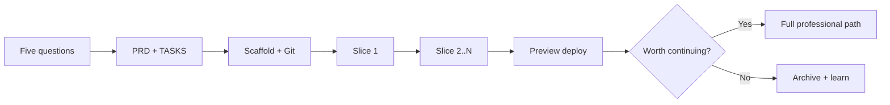
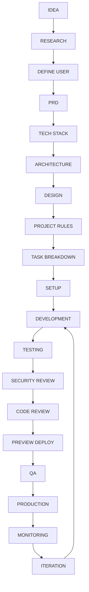
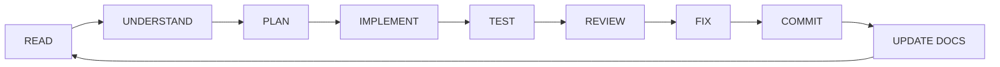

# Vibe Coding Playbook: Idea to Production

> A practical, beginner-to-production guide for building software with AI as a disciplined teammate - not a magic wand.
>
> **For:** Mina and anyone learning structured AI-assisted development  
> **Case study:** PulseBoard - a simple habit tracker used as a running example  
> **Stack focus:** Cursor - Next.js - TypeScript - Tailwind - Supabase - Playwright - Vercel - GitHub

---

## Table of contents

- [Part 0 - Weekend MVP path](#part-0--weekend-mvp-path)
- [Part 1 - Mindset](#part-1--mindset)
- [Part 2 - Plan](#part-2--plan)
- [Part 3 - Scaffold](#part-3--scaffold)
- [Part 4 - Build](#part-4--build)
- [Part 5 - Ship](#part-5--ship)
- [Part 6 - Run](#part-6--run)
- [Appendix A - Prompt cheat-sheet](#appendix-a--prompt-cheat-sheet)
- [Appendix B - Anti-patterns](#appendix-b--anti-patterns)
- [Appendix C - Definition of done](#appendix-c--definition-of-done)
- [Appendix D - When to stop and re-plan](#appendix-d--when-to-stop-and-re-plan)
- [Appendix E - Common failure modes](#appendix-e--common-failure-modes)
- [Appendix F - File map](#appendix-f--file-map)
- [Appendix G - Cursor agents & skills](#appendix-g--cursor-agents--skills)

---

## Part 0 - Weekend MVP path

If you have one free weekend and want something shippable, follow this compressed path. Skip the deep professional docs until you feel the process working.

### Saturday morning - Clarify

Answer the **five questions** (see Part 1) in a short note. For our running example:

| Question | PulseBoard answer |
|---|---|
| Problem | People start habits, then lose the streak and quit |
| User | Busy professionals who want one simple daily check-in |
| Outcome | They open the app once a day and mark habits done |
| MVP | Sign up, create up to 5 habits, daily checkboxes, streak counter |
| Out of scope | Social feed, coaching AI, calendar sync, mobile app |

### Saturday afternoon - Docs + stack

Create only these files (copy from `templates/`):

1. `PRD.md` - one page  
2. `TASKS.md` - 8-12 vertical slices  
3. `RULES.md` - how the AI should behave  

Pick the **beginner stack** (Part 3). Initialize git immediately.

### Sunday - Build one vertical slice at a time

Loop: pick the next task -> six-part prompt -> implement -> smoke test -> commit.

Ship a **preview** deploy (Vercel preview URL). Do not call it "production" until you have:

- Env vars set for that environment  
- A login flow that works end-to-end  
- At least one happy-path Playwright (or manual) checklist  

**Tip:** A weekend MVP is allowed to be ugly. It is not allowed to be undocumented or uncommitted.



When the weekend path works, graduate to the full pipeline below.

---

## Part 1 - Mindset

### What "vibe coding" means here

**Vibe coding** (in this playbook) means: you stay in flow with AI, but you never skip the spine of product thinking. Feeling productive is not the same as shipping something that works for a real user.

The non-negotiable pipeline:



Never jump from IDEA straight to DEPLOY. AI makes that jump tempting - and expensive to undo.

### The five questions before coding

Write answers before you open the editor:

1. **Problem** - What pain exists today without your product?  
2. **User** - Who feels that pain most acutely?  
3. **Outcome** - What does success look like in their week?  
4. **MVP** - What is the smallest thing that delivers that outcome?  
5. **Out of scope** - What will you proudly refuse to build in v1?

**PulseBoard example:** Out of scope includes team competitions and wearable integrations. Saying no early keeps AI from inventing features you must then maintain.

### Research before coding

Spend 30-90 minutes (or a day for serious projects) on:

| Research lens | What to capture | PulseBoard example |
|---|---|---|
| Users | Jobs-to-be-done, objections | "I forget by evening" -> need reminders + frictionless check-in |
| Competitors | What they do well / poorly | Many habit apps are heavy; opportunity = ruthless simplicity |
| Feasibility | Auth, data model, hosting cost | Email/password or magic link via Supabase is enough for MVP |

Dump notes into `MEMORY.md` so future-you (and the AI) can recall them.

### Tool choice by project type

| Situation | Prefer | Why |
|---|---|---|
| Absolute beginner prototype | Replit, Lovable, Bolt | Fast visual feedback, less local setup |
| Learning + control + production path | **Cursor** (or Claude Code) | Full repo, git, rules, tests |
| Tiny script / one-off | Chat + local editor | Overhead of a full IDE is waste |
| Team / serious product | Cursor + GitHub + CI | Reviewability and rollback |

This playbook assumes **Cursor** for the main path. Prototyping tools are fine for ideation; graduate when you care about ownership of the codebase.

### Minimum beginner setup vs professional structure

| Layer | Weekend / beginner | Professional |
|---|---|---|
| Docs | PRD, TASKS, RULES | + ARCHITECTURE, DESIGN, DECISIONS, MEMORY, TEST_PLAN, SECURITY |
| Tests | Manual checklist + 1-2 E2E | Unit + API + Playwright suite + CI |
| Deploy | One preview env | Preview + staging + production |
| Rules | One `general.mdc` | + frontend / backend / testing rules |
| Observability | Console + Vercel logs | Error tracking + basic metrics + alerts |

Start thin. Add structure when pain appears - not before, not never.

---

## Part 2 - Plan

### Docs-first: why paper before pixels

AI without context invents architecture. Docs are the shared brain between you and the model. Keep them short and living; dead docs are worse than none.

### Core documents

| File | Purpose | When required |
|---|---|---|
| `PRD.md` | Problem, users, MVP, success metrics | Always |
| `ARCHITECTURE.md` | Systems, data flow, boundaries | Serious / multi-surface |
| `DESIGN.md` | UX flows, UI principles, key screens | If UI matters |
| `RULES.md` | How AI + humans must work in this repo | Always |
| `TASKS.md` | Ordered vertical slices | Always |
| `DECISIONS.md` | Architecture Decision Records (ADRs) | Serious |
| `MEMORY.md` | Research, gotchas, "why we did X" | Recommended |
| `TEST_PLAN.md` | Risks, coverage map, DoD for quality | Serious |
| `SECURITY.md` | Threat notes, auth rules, secrets policy | Before production |

Fill-in templates live in `templates/`. Copy them into your project root (or `docs/`) and replace `{{PLACEHOLDERS}}`.

### Writing a useful PRD (PulseBoard sketch)

Keep sections tight:

- **Vision** - One sentence: "PulseBoard helps busy people keep tiny daily habits visible."  
- **Personas** - Primary: "Alex, 32, knowledge worker."  
- **User stories** - "As Alex, I can mark today's habits done in under 10 seconds."  
- **MVP scope** - Auth, habit CRUD (max 5), daily check-ins, streak.  
- **Non-goals** - Social, AI coaching, native apps.  
- **Success metrics** - 3-day retention of check-ins for 40% of signups (aspirational for learning projects).

### Task breakdown: vertical slices

A **vertical slice** delivers a thin path through UI -> logic -> data -> test. Prefer slices over horizontal layers ("build all APIs first").

Good PulseBoard slices:

1. Project scaffold + health check page  
2. Auth (sign up / sign in / sign out)  
3. Create habit form + list  
4. Daily check-in toggle  
5. Streak calculation display  
6. Empty states + basic validation  
7. E2E smoke: signup -> create habit -> check in  

Bad slices: "Build entire database schema." / "Style every page." / "Add all error handling."

### Tech stack recommendation (beginners)

| Concern | Choice | Notes |
|---|---|---|
| Editor / AI | Cursor | Rules + composer + git |
| App framework | Next.js (App Router) | Full-stack friendly |
| Language | TypeScript | Catches AI mistakes early |
| Styling | Tailwind CSS | Fast iteration |
| Backend / DB / Auth | Supabase (Postgres) | Auth + DB without ops fatigue |
| E2E tests | Playwright | Close to user reality |
| Hosting | Vercel | Preview deploys for free tier learning |
| Source control | GitHub | PRs even if you are solo |

Alternatives are fine when you have a reason - record them in `DECISIONS.md`.

---

## Part 3 - Scaffold

### Environment setup (verify, don't assume)

Typical local verify loop:

```bash
node -v          # LTS recommended
npm -v
git --version
# After creating the Next.js app:
npm install
npm run dev
# Optional:
npx playwright install
```

Confirm Supabase project URL and anon key exist in `.env.local` (never commit secrets). Use `.env.example` with **empty** keys only.

### Git from day one

AI can rewrite half your repo in one enthusiastic turn. Git is your seatbelt.

Minimum habit:

```bash
git init
git add .
git commit -m "chore: initial scaffold"
```

Then commit after every green slice. Prefer small commits with verbs: `feat:`, `fix:`, `docs:`, `test:`, `chore:`.

**Tip:** If the AI thrash-ed files, `git checkout -- path` or `git restore` is faster than arguing with the model.

### Project rules for the AI

Put durable instructions in Cursor rules (`templates/.cursor/rules/`):

- `general.mdc` - tone, docs-first, no secrets, slice discipline  
- `frontend.mdc` - Next.js / Tailwind conventions  
- `backend.mdc` - Supabase / API boundaries  
- `testing.mdc` - Playwright and test expectations  

Also keep a human-readable `RULES.md` that mirrors the spirit of those files.

### Give AI context before code

Before the first feature prompt, attach or `@`-mention:

- `PRD.md`  
- `ARCHITECTURE.md` (if present)  
- `TASKS.md` (current slice)  
- Relevant existing files  

Ask the model to **restate the task and constraints** before writing code. If the restatement is wrong, correct it - do not "just generate."

---

## Part 4 - Build

### The feature loop



1. **READ** - Open the task, related docs, and existing code.  
2. **UNDERSTAND** - Restate acceptance criteria in your own words (or force the AI to).  
3. **PLAN** - List files to touch; avoid drive-by refactors.  
4. **IMPLEMENT** - One slice; keep the diff reviewable.  
5. **TEST** - Manual path + automated where it pays off.  
6. **REVIEW** - Diff against PRD / RULES / SECURITY notes.  
7. **FIX** - Tight loop; don't pile new features on broken ones.  
8. **COMMIT** - Message describes *why*.  
9. **UPDATE DOCS** - TASKS checkboxes, DECISIONS, MEMORY gotchas.

### The six-part prompt

Use this shape for almost every implementation ask:

```text
CONTEXT:
{{what product / slice / constraints; @ files}}

TASK:
{{one clear outcome}}

FILES:
{{paths to create or edit; "do not touch X"}}

CONSTRAINTS:
{{stack, style, no new deps without asking, a11y, etc.}}

ACCEPTANCE CRITERIA:
- {{observable behavior 1}}
- {{observable behavior 2}}

TESTING:
{{how you will verify; ask AI to add/adjust tests}}
```

**PulseBoard example (check-in toggle):**

```text
CONTEXT:
PulseBoard habit tracker. PRD and TASKS attached. Auth works. Habits list exists.
We use Next.js App Router + Supabase. See @app/habits and @lib/supabase.

TASK:
Implement today's check-in toggle for a habit: mark done / undo for the local date.

FILES:
Create or edit only: components/CheckInToggle.tsx, app/actions/checkin.ts,
and a Playwright test under e2e/checkin.spec.ts. Do not change auth.

CONSTRAINTS:
TypeScript strict. No new dependencies. Use server actions. Idempotent per habit+date.

ACCEPTANCE CRITERIA:
- Clicking toggles done state for today only
- Streak updates after refresh
- Second click undoes without deleting the habit

TESTING:
Add Playwright: signed-in user toggles habit and sees "Done" badge.
```

### One feature at a time

Parallel AI threads that edit the same files cause merge pain and silent overwrites. Serialize work: finish, test, commit, then next.

### Structured debugging

When something breaks:

1. Reproduce with a minimal path (write steps).  
2. Isolate layer: UI, network, auth, DB, env.  
3. Read the error fully; paste **relevant** logs into the prompt, not your entire terminal history.  
4. Ask for a hypothesis list ranked by likelihood.  
5. Change one variable at a time.  
6. Add a regression test when the bug was real.

### Review against docs

Before marking a task done, ask:

- Does this still match the PRD MVP?  
- Did we invent scope?  
- Are RULES honored (naming, folder layout, no secrets)?  
- Is SECURITY.md impacted (new endpoint, new PII)?  

If docs and code disagree, **update one of them deliberately** - usually the code is wrong for MVP, or the doc needs a dated decision entry.

---

## Part 5 - Ship

### Preview before production

Every merge to main (or a PR branch) should get a **preview URL**. Share that URL for QA. Production is a conscious promotion, not an accident.

### Env vars per environment

| Variable | Local | Preview | Production |
|---|---|---|---|
| `NEXT_PUBLIC_SUPABASE_URL` | project URL | same or separate | production project |
| `NEXT_PUBLIC_SUPABASE_ANON_KEY` | anon | anon | anon |
| Service role keys | local only if needed | **never** in client | server-only secrets store |

Never put service-role keys in `NEXT_PUBLIC_*`. Rotate anything that leaked into chat or screenshots.

### Production QA checklist (short)

- [ ] Sign up / sign in / sign out  
- [ ] Primary happy path (PulseBoard: create habit -> check in -> see streak)  
- [ ] Empty and error states  
- [ ] Mobile-width smoke  
- [ ] Env vars present on the host  
- [ ] No secrets in client bundles or public repo  

### Security review (lightweight)

Before calling it production:

- Auth on every sensitive route / RLS policies on tables  
- Input validation on writes  
- Least-privilege keys  
- Dependency eyeball (`npm audit` as a signal, not gospel)  
- Capture findings in `SECURITY.md`

### Code review (even solo)

Read your own diff as if a skeptical teammate wrote it. Prefer asking AI: "Review this diff against RULES.md and SECURITY.md; list risks only."

---

## Part 6 - Run

### Monitoring

Minimum:

- Hosting logs (Vercel)  
- Auth failure spikes  
- Client error reporting when you are ready (e.g. a simple error boundary + log)

Serious projects add: uptime check, error tracker, basic product analytics for the one metric in the PRD.

### Iteration without chaos

Feed learnings back into:

- `TASKS.md` - next slices  
- `MEMORY.md` - user quotes and surprises  
- `DECISIONS.md` - when you change approach  
- `PRD.md` - only when scope truly changes (date the change)

### Keep docs alive

Budget 10 minutes at the end of a session for doc hygiene. Stale TASKS checkboxes and forgotten ADRs are how vibe coding becomes vibe *guessing*.

---

## Appendix A - Prompt cheat-sheet

| Intent | Starter line |
|---|---|
| Orient | "Read PRD + TASKS task N. Restate the slice and list files you'll touch. Do not code yet." |
| Implement | Use the six-part prompt |
| Tests | "Add Playwright covering acceptance criteria X; do not weaken assertions." |
| Review | "Review the diff vs RULES and SECURITY; output findings only." |
| Debug | "Given repro steps + error, list 3 hypotheses; propose the smallest probe." |
| Docs | "Update TASKS and DECISIONS to reflect what we shipped; no fluff." |
| Refactor | "Refactor only {{path}} for {{goal}}; no behavior change; keep tests green." |

---

## Appendix B - Anti-patterns

1. **Prompt-and-pray** - No docs, no acceptance criteria, accept first output.  
2. **Horizontal excavation** - Building all schemas / all components before a single working path.  
3. **Secret paste** - Dropping API keys into chat or committing `.env`.  
4. **Scope snowball** - "While you're at it, add dark mode, teams, and Stripe."  
5. **No git** - Until the first catastrophic overwrite.  
6. **Docs as archaeology** - Written once, never updated.  
7. **Test theater** - Assertions that only check `expect(true).toBe(true)`.  
8. **Production = laptop works** - Skipping preview and env parity.  
9. **Multi-agent file fight** - Two AI sessions editing the same module.  
10. **Fix-by-rewrite** - Rewriting the app because one bug annoyed you.

---

## Appendix C - Definition of done

A slice is **done** when:

- [ ] Acceptance criteria observable in the running app  
- [ ] Happy path tested (automated or written manual checklist executed)  
- [ ] No known severity-high bugs in this slice  
- [ ] Diff reviewed against PRD / RULES  
- [ ] Committed with a clear message  
- [ ] TASKS.md updated  
- [ ] New decisions / secrets / threats captured if relevant  

A **release** is done when the Production QA checklist passes and monitoring is at least watching logs.

---

## Appendix D - When to stop and re-plan

Stop coding and return to docs if:

- You cannot explain the next slice in one sentence  
- The AI keeps inventing tables / routes not in ARCHITECTURE  
- Bugs require touching more than ~5 unrelated files repeatedly  
- MVP scope has silently doubled  
- You are debating frameworks mid-feature  
- Security model is unclear (who can read/write what?)  

Re-plan ritual: update PRD/ARCHITECTURE -> rewrite the next 3 tasks -> one clarifying prompt -> resume.

---

## Appendix E - Common failure modes

| Symptom | Likely cause | First move |
|---|---|---|
| AI ignores your stack | Weak RULES / no @ context | Paste RULES; ask for restatement |
| Auth works locally, fails on preview | Env vars missing / wrong | Compare env matrices |
| Flaky E2E | Race on hydration / network | Prefer role/text locators; await UI |
| Streak wrong | Timezone / "today" ambiguity | Define date rules in DESIGN/ARCHITECTURE |
| Huge unreviewable diff | Too big a task | Split TASKS; revert; redo smaller |
| "It deleted my feature" | No commit boundary | Restore from git; smaller prompts |

---

## Appendix F - File map

| Path in this pack | Role |
|---|---|
| `VIBE_CODING_GUIDE.md` | This playbook |
| `QUICKSTART.md` | One-page minimum path |
| `MANIFEST.md` | Pack inventory |
| `CURSOR_SETUP.md` | Install/use agents, skills, rules |
| `templates/*.md` | Copy-into-project docs (incl. `AGENTS.md`) |
| `templates/.env.example` | Empty env key names |
| `templates/README.md` | Project README skeleton |
| `templates/.cursor/rules/*.mdc` | Cursor rule stubs |
| `templates/.cursor/agents/*.md` | Subagents: planner, implementer, reviewer, verifier |
| `templates/.cursor/skills/*/SKILL.md` | Skills: six-part-prompt, vertical-slice, structured-debug, docs-sync, ship-check |

---

## Appendix G - Cursor agents & skills

A lean BEST-OF pack lives under `templates/.cursor/`. Install and usage details: **[`CURSOR_SETUP.md`](./CURSOR_SETUP.md)**.

| Kind | Names | Purpose |
|---|---|---|
| Agents | `planner`, `implementer`, `reviewer`, `verifier` | Plan -> build -> review -> prove one TASKS item |
| Skills | `six-part-prompt`, `vertical-slice`, `structured-debug`, `docs-sync`, `ship-check` | Prompt template, slice discipline, debug, doc sync, pre-ship checklist |

**Daily loop:** planner -> implementer -> verifier -> docs-sync. Use reviewer before merge; `/ship-check` before preview or production. Slash-only skills: `/six-part-prompt`, `/ship-check`.

Do not invent Cursor features beyond official agent/skill formats documented in `CURSOR_SETUP.md`.

---

## Closing note

Vibe coding works when the vibe is **disciplined curiosity**: fast loops, small slices, written intent, and respect for production. Start with Part 0 this weekend. Let PulseBoard (or your own idea) teach you the pipeline. Then thicken the docs only as the product earns them.

Ship something small. Measure one outcome. Iterate on purpose.
